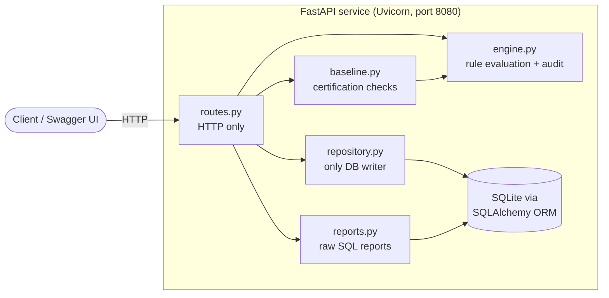
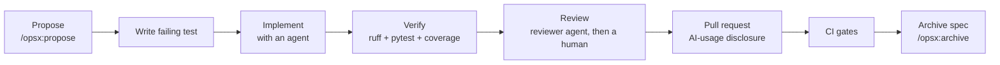

# PolicyLens

**A firewall policy analyzer: audit rule sets, certify them against a security baseline, and ship the service to OpenShift through an automated, spec-driven, agent-assisted pipeline.**

> AI-generated proof of concept: this repository was created in a single AI-assisted build to demonstrate a resume-ready engineering workflow rather than a long-lived production codebase. The goal is to show spec-first design, agentic development guardrails, GitHub Actions automation, unit and API testing, container scaffolding, and deployment-oriented configuration. The project uses synthetic mock data only and intentionally includes the project structure and automation patterns that would normally be built across a team workflow, even though the Git history is intentionally short for a portfolio artifact.

[](https://github.com/hgibso21-glitch/policylens/actions/workflows/ci.yml)
[](https://github.com/hgibso21-glitch/policylens/actions/workflows/deploy-openshift.yml)


[](https://github.com/astral-sh/ruff)


> **GitHub badge setup:** update the repository owner in this file and in [deploy/openshift/kustomization.yaml](deploy/openshift/kustomization.yaml) to match your GitHub username so the badges resolve on the published repo. The CI and Deploy badges will turn live after the first workflow run. The "57 passing" badge is a snapshot; the coverage gate itself is enforced by CI.

All data in this repository is **synthetic mock data**. No real network, firewall or company information is used anywhere.

---

## Portfolio note: one-shot AI-generated prototype

This repository was built as a portfolio project to demonstrate a complete spec-driven engineering workflow: OpenSpec requirements, agentic development guardrails, automated CI/CD checks, container scaffolding, and a production-style service design. It is intentionally built as a clean, self-contained project artifact that showcases disciplined software engineering practices while using synthetic mock data only.

The value here is not just the firewall rule logic itself. The project showcases:

- Spec-based development with OpenSpec before implementation
- Agentic development guardrails via [AGENTS.md](AGENTS.md), [CLAUDE.md](CLAUDE.md), and [.github/copilot-instructions.md](.github/copilot-instructions.md)
- GitHub Actions automation for linting, tests, coverage, OpenSpec validation, and image smoke checks
- Security-focused container and deployment scaffolding for Docker and OpenShift
- Synthetic data and clear separation of pure logic, API routes, persistence, and deployment config

This makes the repository useful as a resume project and interview artifact: it demonstrates the ability to design a small system end-to-end, enforce quality gates, and work with AI agents in a disciplined, reviewable way.

## Contents

- [What it does](#what-it-does)
- [Architecture](#architecture)
- [Quick start](#quick-start)
- [Mock data](#mock-data)
- [API reference](#api-reference)
- [Baseline checks](#baseline-checks)
- [Quality: tests and coverage](#quality-tests-and-coverage)
- [Spec-driven, agent-assisted workflow](#spec-driven-agent-assisted-workflow)
- [CI/CD pipeline](#cicd-pipeline)
- [Container and OpenShift](#container-and-openshift)
- [Configuration](#configuration)
- [Project structure](#project-structure)
- [Roadmap](#roadmap)
- [Use it as a template](#use-it-as-a-template)
- [Contributing](#contributing)

---

## What it does

Firewall rule sets grow over time and nobody wants to touch them. PolicyLens answers two questions about a rule set, offline, without touching a live firewall:

1. **Audit:** which rules can never match (*shadowed*), which repeat an earlier rule (*duplicate*), and which are dangerously broad (*permissive*)?
2. **Certification:** does the rule set pass a minimum security baseline (no any-to-any allow, no open SSH/Telnet/RDP, ends with a deny-all, no dead rules)?

Rules use named address objects, CIDR networks, protocols and port ranges. They are evaluated top to bottom, the first match wins, and anything unmatched is denied.

## Architecture



The layering is deliberate and enforced in review ([AGENTS.md](AGENTS.md)):

| Layer | Module | Rule |
|---|---|---|
| Pure logic | `engine.py`, `baseline.py` | No web, database or I/O imports, so every function is unit-testable directly |
| Transport | `routes.py`, `schemas.py` | Translates HTTP and Pydantic models to and from the logic layer; no business rules |
| Persistence | `db.py`, `repository.py`, `reports.py` | ORM for reads and writes; raw SQL only for reports |
| Wiring | `main.py`, `seed.py` | App factory, startup, mock data loader |

## Quick start

Requires Python 3.12+.

**Windows (PowerShell)**

```powershell
python -m venv .venv
.venv\Scripts\Activate.ps1
pip install -e ".[dev]"
pytest --cov
$env:SEED_MOCK_DATA = "true"
uvicorn app.main:app --reload
```

**macOS / Linux**

```bash
python -m venv .venv && source .venv/bin/activate
pip install -e ".[dev]"
pytest --cov
SEED_MOCK_DATA=true uvicorn app.main:app --reload
```

Open <http://localhost:8000/docs> for the interactive API. Then try:

```bash
curl localhost:8000/rulesets
curl localhost:8000/rulesets/3/certification
curl localhost:8000/rulesets/2/audit
curl localhost:8000/reports/summary
```

Run the container instead:

```bash
docker build -t policylens .
docker run --rm -p 8080:8080 -e SEED_MOCK_DATA=true policylens
```

## Mock data

`SEED_MOCK_DATA=true` (or `python -m app.seed`) loads three rule sets. Each one is chosen to exercise a different result, and [tests/test_seed.py](tests/test_seed.py) pins the outcomes:

| Rule set | Story | Certified | Failing checks |
|---|---|---|---|
| `prod-web-tier` | A clean three-tier web application | Yes | none |
| `openshift-cluster-egress` | Pod network egress policy, using OpenShift's default pod and service networks. Someone appended an allow rule after a deny that shadows it | No | BL-004 |
| `legacy-dmz` | A neglected DMZ: SSH open to the world, duplicate rules, a temporary any-to-any allow, no cleanup rule | No | BL-001, BL-002, BL-003, BL-004, BL-005 |

## API reference

Interactive docs are served at `/docs` (Swagger UI) and `/redoc`.

| Method | Path | Purpose |
|---|---|---|
| `GET` | `/healthz` | Liveness probe; never touches the database |
| `GET` | `/readyz` | Readiness probe; checks the database |
| `POST` | `/rulesets` | Validate and store a rule set (201, or 422 with a clear message) |
| `GET` | `/rulesets` | List rule sets with rule counts |
| `GET` | `/rulesets/{id}` | Read one rule set |
| `GET` | `/rulesets/{id}/audit` | Shadowed, duplicate and permissive findings with severity |
| `GET` | `/rulesets/{id}/certification` | Pass or fail for each baseline check |
| `GET` | `/reports/summary` | Rule counts per action and protocol (raw SQL) |
| `GET` | `/rulesets/{id}/reachability` | *Planned:* would this packet be allowed, and by which rule? See [Roadmap](#roadmap) |

## Baseline checks

| ID | Check |
|---|---|
| BL-001 | No allow rule from any source to any destination |
| BL-002 | No management ports (SSH 22, Telnet 23, RDP 3389) open to any source |
| BL-003 | The rule set ends with an explicit deny-all cleanup rule |
| BL-004 | No shadowed rules |
| BL-005 | No duplicate rules |

A rule set is certified only when all five pass. The full behaviour is specified in [openspec/specs/](openspec/specs/).

## Quality: tests and coverage

```bash
pytest --cov          # fails if coverage drops below 85%
```

**57 tests**, all running against an in-memory database with no network access:

| Suite | Tests | What it covers |
|---|---:|---|
| [tests/test_engine.py](tests/test_engine.py) | 23 | Rule compilation, first-match evaluation, implicit deny, shadow/duplicate/permissive detection, input validation |
| [tests/test_baseline.py](tests/test_baseline.py) | 7 | Each baseline check passing and failing |
| [tests/test_api.py](tests/test_api.py) | 13 | Endpoints through FastAPI's `TestClient`: success paths, 404, 422, no partial writes |
| [tests/test_seed.py](tests/test_seed.py) | 6 | Mock data is valid, idempotent, and produces the documented outcomes |
| [tests/test_manifests.py](tests/test_manifests.py) | 8 | Guardrail tests: OpenShift manifests stay non-root, resource-limited, and consistent with the Dockerfile |

**Coverage** (measured with `pytest --cov`, branch coverage on):

| Module | Coverage |
|---|---:|
| `app/main.py`, `reports.py`, `repository.py`, `routes.py`, `schemas.py` | 100% |
| `app/baseline.py`, `db.py` | 96% |
| `app/engine.py` | 95% |
| `app/seed.py` | 82% (the command-line entry point is untested) |
| **Total** | **96%** |

Static checks: `ruff check .` (lint, import order, bugbear, pyupgrade) and `ruff format --check .`.

## Spec-driven, agent-assisted workflow

Behaviour is defined in specs before it is coded, and AI agents work inside enforced guardrails. The full guide is in [docs/agentic-workflow.md](docs/agentic-workflow.md).



Guardrails are layered, so no single one is the only line of defence:

| Layer | Where | What it does |
|---|---|---|
| Written rules | [AGENTS.md](AGENTS.md) | Architecture rules, always/never/ask-first lists, definition of done. Read by Claude Code, Copilot and other agents |
| Tool entry points | [CLAUDE.md](CLAUDE.md), [.github/copilot-instructions.md](.github/copilot-instructions.md) | Point each tool at the same source of truth |
| Enforced permissions | [.claude/settings.json](.claude/settings.json) | `.env` unreadable; force-push, hard reset, `rm -rf`, `oc login`, `oc delete` denied; edits to guardrail files require approval |
| Automatic formatting | [.claude/hooks/format_python.py](.claude/hooks/format_python.py) | Hook runs ruff after every agent edit |
| Reviewer agent | [.claude/agents/reviewer.md](.claude/agents/reviewer.md) | Read-only review of a diff against the spec and AGENTS.md |
| Specs | [openspec/](openspec/) | Five baseline specs and one open change, validated in CI |
| Guardrail tests | [tests/test_manifests.py](tests/test_manifests.py) | A manifest that weakens the security context fails the build |
| Human accountability | [.github/pull_request_template.md](.github/pull_request_template.md) | Every PR discloses what the AI did and what the author verified |
| CI gates | [.github/workflows/ci.yml](.github/workflows/ci.yml) | Lint, format, tests, coverage, spec validation, image build |

## CI/CD pipeline

| Workflow | Trigger | Stages |
|---|---|---|
| [ci.yml](.github/workflows/ci.yml) | Push to `main`, every pull request | **Lint and test** (ruff, format check, pytest with 85% coverage gate, coverage artifact) · **Validate OpenSpec** (`--strict`) · **Build and smoke-test image** (runs as an arbitrary non-root uid like OpenShift, then checks `/readyz` and the seeded data) |
| [deploy-openshift.yml](.github/workflows/deploy-openshift.yml) | Manual | Build and push to GHCR, log in with `oc`, `oc apply -k`, wait for rollout, print the URL. Gated by an `openshift` environment for optional approval |
| [dependabot.yml](.github/dependabot.yml) | Weekly | Updates for pip, GitHub Actions and Docker |

## Container and OpenShift

- [Dockerfile](Dockerfile): slim Python 3.12 image, non-root user, group-0 writable `/data`, listens on 8080.
- [deploy/openshift/](deploy/openshift/): Kustomize bundle with a `ConfigMap`, `Deployment`, `Service` and `Route` (edge TLS with redirect). The pod meets the **restricted-v2** security context: non-root, no privilege escalation, all capabilities dropped, `RuntimeDefault` seccomp, resource requests and limits, liveness and readiness probes.
- Deploy target: the free [Red Hat Developer Sandbox](https://developers.redhat.com/developer-sandbox). Step-by-step in [docs/openshift.md](docs/openshift.md).

## Configuration

| Variable | Default | Purpose |
|---|---|---|
| `DATABASE_URL` | `sqlite:///./policylens.db` (`sqlite:////data/policylens.db` in the image) | SQLAlchemy database URL |
| `SEED_MOCK_DATA` | unset | `true` loads the three mock rule sets on startup |

Copy [.env.example](.env.example) to `.env` for local use. `.env` is git-ignored.

## Project structure

```text
app/                    Application code
  engine.py             Pure rule compilation, evaluation and audit
  baseline.py           Pure baseline certification checks
  routes.py             HTTP endpoints
  schemas.py            Pydantic request/response models
  repository.py         Database writes and rule set loading
  reports.py            Raw SQL reporting queries
  db.py                 SQLAlchemy models and engine setup
  seed.py               Mock data and loader
  main.py               FastAPI app factory
tests/                  pytest suites (unit, API, seed data, manifest guardrails)
openspec/               Specs (current behaviour) and changes (proposed work)
deploy/openshift/       Kustomize manifests for OpenShift
docs/                   Workflow and deployment guides
.github/                CI/CD workflows, PR template, Dependabot, Copilot instructions
.claude/                Agent permissions, hook and reviewer agent
AGENTS.md               Guardrails for AI agents and contributors
Dockerfile              Container image
pyproject.toml          Dependencies, packaging, ruff, pytest and coverage config
```

## Roadmap

- [ ] **Reachability endpoint**: the first open OpenSpec change, fully specified in [openspec/changes/add-reachability-endpoint/](openspec/changes/add-reachability-endpoint/). The engine and response schemas already exist; the route and its tests do not.
- [ ] A single-page UI: reachability form and a rules table that highlights shadowed rules.
- [ ] Multi-firewall path analysis across two or three rule sets in sequence.
- [ ] Update and delete for rule sets.

## Use it as a template

The engineering system here (tests, container, OpenShift manifests, CI, specs, agent guardrails) is not specific to firewalls. To build a similar project on the same foundation, follow [docs/adapting-the-template.md](docs/adapting-the-template.md).

## Contributing

1. Read [AGENTS.md](AGENTS.md).
2. Start from an OpenSpec change, write the failing test first, then the code.
3. `ruff check . && ruff format --check . && pytest --cov` must pass.
4. Open a pull request using the template, including the AI-usage section.
